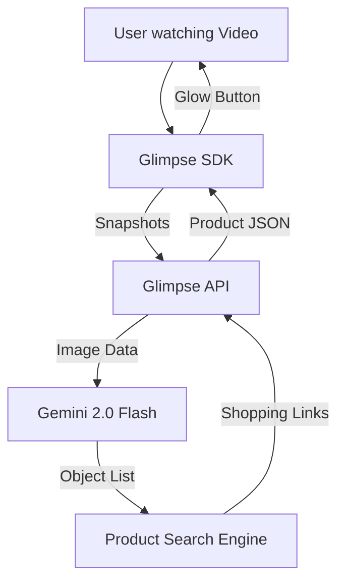

# Glimpse: Technical Architecture

## System Overview
Glimpse consists of three primary layers:
1. **Integration Layer (SDK)**: Client-side JS/TS library injected into video players.
2. **Intelligence Layer (API)**: FastAPI backend for frame analysis and product mapping.
3. **Commerce Layer (Partnerships)**: External APIs for product catalog retrieval.

---

## 1. Integration Layer (The SDK)
The SDK is designed to be lightweight and compatible with high-security streaming environments (DRM).

### Video Player Abstraction
To support Netflix, HBO, Disney+, etc., the SDK uses an abstraction layer to communicate with different player types:
- **HTML5 Player**: Direct access to `<video>` element.
- **Shaka / Dash.js**: Intercepting media segments or using player-specific event listeners.
- **Proprietary Players**: DOM mutation observers to find the video container and overlay UI.

### Frame Metadata Capture
Instead of sending full video streams (too slow), the SDK:
- Captures high-res snapshots (keyframes) every few seconds during active scenes.
- Extracts current timestamp and video ID.
- Sends base64 or binary chunks to the Glimpse API.

### UI Overlay System
- **Shadow DOM**: To prevent style leaks and maintain high-security isolation on 3rd party sites.
- **Canvas Overlay**: For precisely mapping the "Glow" effect to detected objects if bounding box data is provided.

---

## 2. Intelligence Layer (The Backend)
Built using FastAPI for high concurrency and low latency.

### Vision Processing Workflow
1. **Receiver**: Accepts frame snapshots from the SDK.
2. **Scene Analysis**: Uses **Gemini 2.0 Flash** to identify prominent objects in the scene.
3. **Product Lookup**: Converts AI descriptions into product queries (e.g., "Person wearing blue denim jacket in Netflix movie X").
4. **Link Generation**: Searches via Google Shopping/Amazon/Affiliate APIs to find the best buy links.

### Persistence (PostgreSQL/PostGIS)
- Stores pre-processed metadata for popular movies to minimize AI calls (caching).
- Tracks user interactions for "Glow" button performance.

---

## 3. Data Flow Diagram

