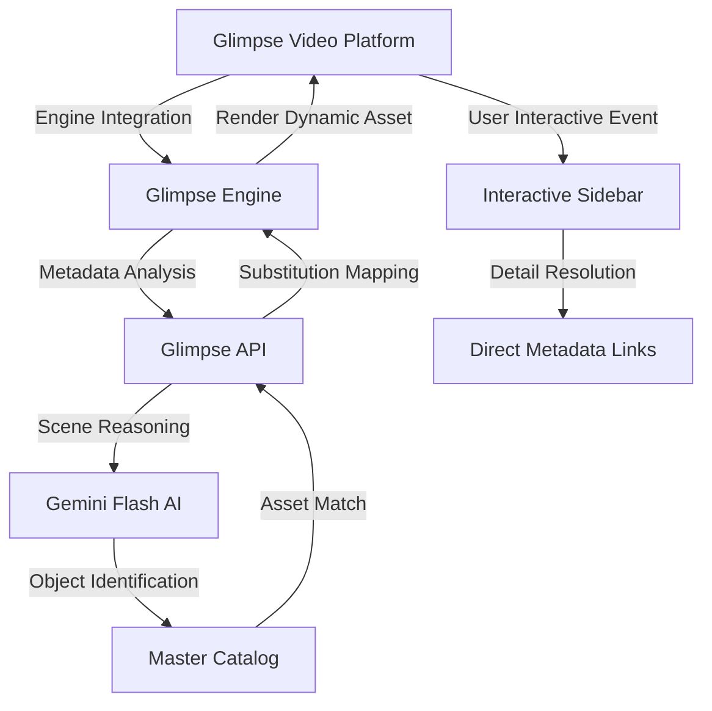

# Glimpse: System Architecture

## Vision & Scope
Glimpse is a high-performance video interpretation engine designed to provide low-latency computer vision and seamless UI injection. The architecture is built for modularity and scalability, leveraging modern web standards and AI-driven reasoning.

---

## 1. Interaction Layer (The Engine)
The core engine provides the interface between the video player and the intelligence layer.

### Component Architecture
- **Overlay Controller**: Detects and tracks objects in the video stream via synchronized metadata.
- **Substitution Engine**: Dynamic asset replacement using AI-generated masks or overlays.
- **Interactive Sidebar**: A reactive UI component for detailed metadata exploration and user interaction.

### Modern UI Isolation
- **Shadow DOM / Scoped CSS**: Ensures the Glimpse UI components remain isolated from the core platform's global styles and scripts.

---

## 2. Intelligence Layer (The Backend)
Built on FastAPI + Gemini Pro/Flash for vision reasoning.

### Scene Interpretation Workflow
1. **Scene Hash Analysis**: The engine transmits frame-hashes and scene metadata to the interpreting API.
2. **Object Identification**: Gemini Flash reasons about the scene's contents (e.g., "beverage container", "branded apparel").
3. **Dynamic Logic Engine**:
   - Compares identified objects against the **Master Catalog**.
   - If a match is found, retrieves spatial coordinates and metadata.
   - Triggers the **Substitution Pipeline** for real-time asset replacement.
4. **Metadata Resolution**: Retrieves pre-verified links and info for high-speed user retrieval.

### Persistence (PostgreSQL / PostGIS)
**Migration State**: Currently transitioning from a Supabase Surface to a dedicated FastAPI/PostgreSQL architecture.
- **Master Catalog**: Stores high-resolution assets and spatial metadata for substitutions.
- **Temporal/Spatial Data**: Utilizing PostGIS for high-precision coordinate tracking across video frames.
- **Engagement Analytics**: High-performance logging for engagement and conversion metrics.

---

## 3. Data Flow Diagram

