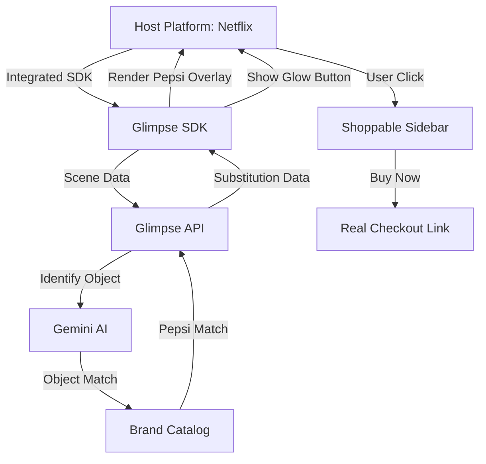

# Glimpse: Technical Architecture (B2B SDK)

## Vision & Scope
Glimpse is designed to provide high-scale technical engineering to solve the dual challenges of **low-latency computer vision** and **seamless DOM-isolated UI injection**. This architecture is built to be modular, efficient, and capable of supporting high-traffic streaming environments.

---

## System Overview

## System Overview

## 1. Integration Layer (The SDK)
The SDK is designed for deep integration into host video players.

### Component Architecture
- **Glow Controller**: Detects objects in the video and renders a "Glow" effect or branded replacement.
- **Substitution Engine**: Replaces non-partner products with partner products (e.g., Coke -> Pepsi) using AI-generated overlays or masks.
- **Shoppable Sidebar**: A slide-out UI for instant checkout, save-for-later, and product details.

### Security & Isolation
- **IFrame/Shadow DOM**: The Sidebar and Overlay run in isolated environments to avoid interfering with the host platform's UI/UX.

---

## 2. Intelligence Layer (The Backend)
Built on FastAPI + Gemini Pro/Flash for vision reasoning.

### Brand Placement Workflow
1. **Real-time Fragment Analysis**: SDK sends frame-hash and scene metadata.
2. **Object Recognition**: Gemini identifies objects (e.g., "beverage can", "denim jacket").
3. **Substitution Logic**:
   - If the object is a **Partner Product**, show the "Glow" button.
   - If the object is a **Competitor Product** (e.g., Coke), apply the **Substitution Mask** (e.g., Pepsi branding).
4. **Link Engine**: Retrieves pre-verified, non-rotating links from the Brand Catalog for instant checkout.

### Persistence (PostgreSQL/PostGIS)
- **Brand Catalog**: Stores high-res textures for substitution and direct checkout links.
- **Analytics**: Tracks "Views", "Glow Clicks", and "Checkout Conversion" for B2B reporting.

---

## 3. Data Flow Diagram

